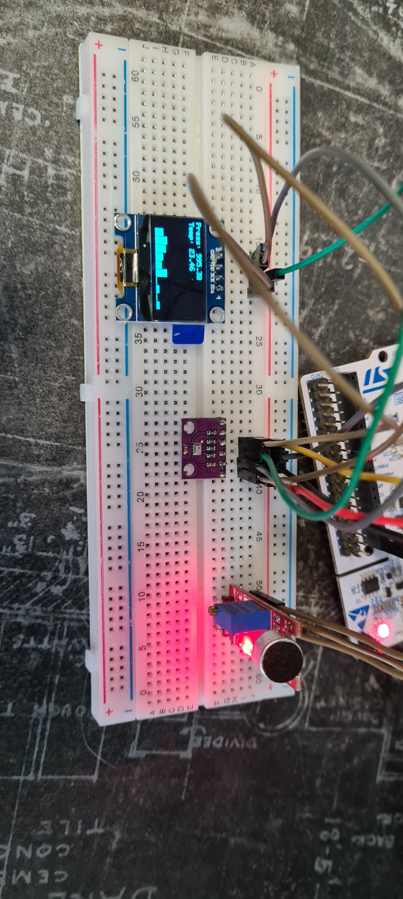

# OLED visualization with RTOS 

The goal was to adapt all functionalities from my previous project [OLED Visualization](https://github.com/Mefiu1000/OLED_visualization) to work in FreeRTOS application.
The application combines measurements from 2 sensors and displays them on OLED screen:
- BMP280 sensor to measure temperature and pressure.
- Microphone with sound sensor KY037 to measure sound and then calculate FFT to display certain frequencies.
- SSD1306 OLED monochromatic screen to display BMP280 data as values and microphone FFT frequencies as columns chart.

Whole application was run on STM32F411RE Nucleo board. To calculate FFT much faster, arm math function was added to project.
To draw shapes and texts on OLED, a GFX_BW library was added. Its a library based on adafruit library dedicated to these OLEDs.

    

    Wired components

## FreeRTOS
  
Application is using FreeRTOS, but is written with CMSIS-RTOS v2 API. Code is generated with a use of bulit-in CubeIDE CubeMX.

Used modules:
- Task
    - BMP280 operation
    - SSD1306 OLED operation
    - Microphone operation and FFT calculation
    - Heartbeat
- Queue
    - Exchange data measured by BMP280 task with OLED task
    - Exchange data measured by Microphone task with OLED task
- Timer 
    - Control at which frequency data from BMP280 is send to display it on OLED
- Binary semaphore
    - Used in combination with timer, which releases it
- Mutex 
    - Ensures that only one task at a time is sending data to terminal
    - Ensures that only one device (OLED or BMP280) is using shared I2C at a time
- Thread flag
    - Notification for FFT task that ADC conversion is completed and calculations can be started

## Print functions

Print functions from standard library can cause RTOS application to malfunction (memory issues, thread safety). Therefore I decided to use implementation of these functions from [mpaland repository](https://github.com/mpaland/printf), which requires to simply add printf.c/h files to our project.

## Programming

##### Whole program was written with a use of HAL library. Each functionality is in seperate files in My_library folder:
- BMP280.c/h
- GFX_BW.c/h 
- logo.h 
- SSD1306_OLED.c/h 
- fonts

Used peripheriales:
- ADC
    - Read data from microphone 
- DMA
    - Handle ADC operation
- Timers 
    - Trigger ADC conversion start to measure data with frequency ~44.1 kHz
    - Timebase source for HAL functions
- I2C
	- BMP280 communication
  - OLED communication
 
## Software

- STM32CubeIDE with built-in CubeMX version 1.14.1 - programming and configuration
- FreeRTOS version 10.3.1

## Peripherals documentation

[BMP280](https://cdn-shop.adafruit.com/datasheets/BST-BMP280-DS001-11.pdf)

[SSD1306](https://cdn-shop.adafruit.com/datasheets/SSD1306.pdf)

[Microphone KY037](https://datasheetspdf.com/pdf-file/1402047/Joy-IT/KY-037/1)
